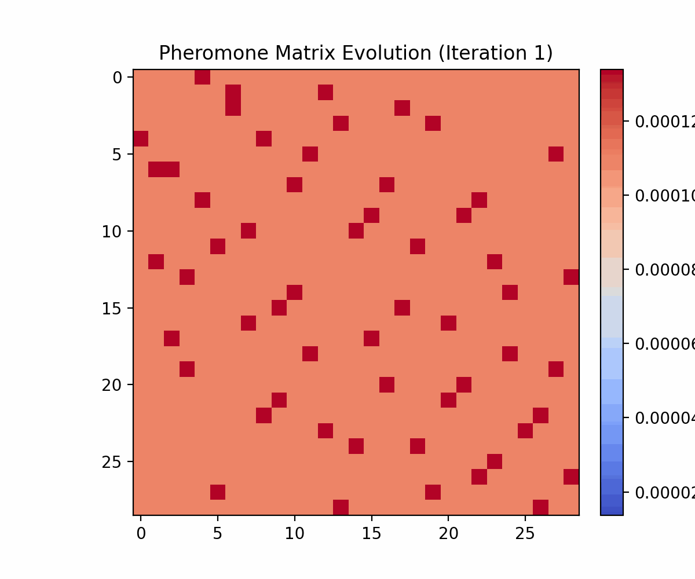
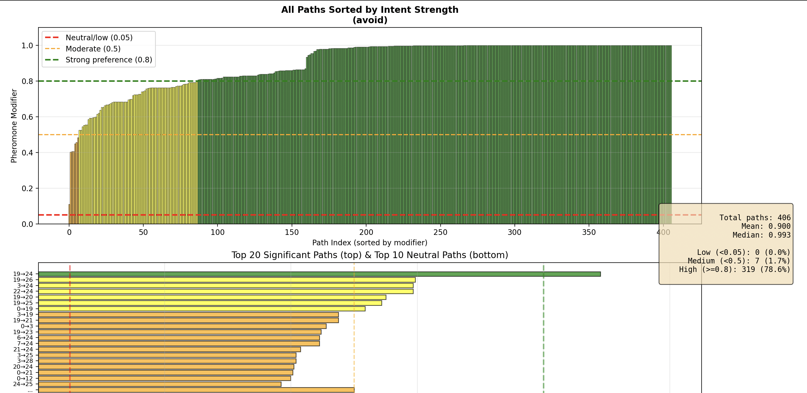

<div align="center">

# ROCA: **ACO + NLP + RL routing engine with visualization**

[Architecture](#architecture) • [Quick Start](#quick-start) • [Demo](#demo)

</div>

---

## Table of Contents

- [Overview](#overview)
- [Architecture](#architecture)
  - [ACO Engine](#aco-engine)
  - [NLP Constraint Layer](#nlp-constraint-layer)
  - [Adaptive Ant Parameters](#adaptive-ant-parameters)
  - [RL Policy Integration](#rl-policy-integration)
- [Installation](#installation)
  - [Prerequisites](#prerequisites)
  - [Setup](#setup)
- [Quick Start](#quick-start)
---

## Overview

ROCA is a hybrid routing optimization framework that combines the power of Ant Colony Optimization (ACO) with Natural Language Processing (NLP) and Reinforcement Learning (RL). It enables solving TSP(traveling salesman problem) with natural language constraints and dynamic graph editing.

**Why ROCA?**
- **Advanced ACO**: Per-ant adaptive parameters with evolutionary selection
- **Natural Language Constraints**: Specify routing requirements in plain English
- **RL Integration**: TODO
- **Interactive Visualization**: Real-time Plotly-based graph editing and metrics
---

## Architecture

### ACO Engine

The core ACO implementation constructs tours using pheromone trails and heuristic values:

- **Transition Rule**: Ants choose next nodes based on `P(i→j) ∝ τᵅ · ηᵝ`
  - `τ`: pheromone intensity
  - `η`: heuristic information (typically 1/distance)
  - `α`: pheromone importance weight
  - `β`: heuristic importance weight

- **Pheromone Update**: Offline evaporation and deposition after each iteration
- **Dynamic Constraints**: Real-time graph modifications during optimization

### NLP Constraint Layer

Converts natural language constraints into operational routing modifications

The NLP layer generates constraint modifiers `C^NLP_i,j(t)` that are multiplicatively applied to the standard ACO transition probabilities, allowing natural language instructions to directly influence routing decisions, while highest probability nodes are fully masked inclusive/exclusively respectively. 

### Adaptive Ant Parameters

Each ant evolves its own optimization parameters:

- **Individual Parameters**: Every ant maintains (α, β)
  - `α`: pheromone weight
  - `β`: heuristic weight  

- **Evolution Mechanism**:
  - Log-normal drift per optimization step
  - Selection of best performers each macro-iteration
  - Diversity preservation via variance thresholds

### RL Policy Integration

*(TODO)*

## Installation

### Prerequisites

- Python 3.8 or higher
- pip package manager

### Setup

1. **Clone the repository**
   ```bash
   git clone https://github.com/Vparikh01/ROCA.git
   cd ROCA
   ```

2. **Create a virtual environment**
   ```bash
   python3 -m venv .venv
   source .venv/bin/activate  # On Windows: .venv\Scripts\activate
   ```

3. **Install dependencies**
   ```bash
   pip install -r requirements.txt
   ```
---

## Quick Start

Run a basic TSP example with visualization:

```python
import os
import pickle
import numpy as np
import networkx as nx
import matplotlib.pyplot as plt
from ROCA.src.aco.engine import MaxMinACO

# Load a TSPLIB instance (adjust path as needed)
BASE_DIR = os.path.dirname(os.path.abspath(__file__))
pkl_path = os.path.join(BASE_DIR, "..", "tsplib_graphs", "bier127.pkl")

with open(pkl_path, "rb") as f:
    data = pickle.load(f)

coords = np.asarray(data["coordinates"])
n = len(coords)

# Build graph
G = nx.Graph()
for i in range(n):
    for j in range(i + 1, n):
        dist = float(np.linalg.norm(coords[i] - coords[j]))
        G.add_edge(i, j, weight=dist)

# Build cost matrix
required_nodes = list(G.nodes())
cost_matrix = np.zeros((n, n))
for i in range(n):
    for j in range(n):
        if i != j:
            cost_matrix[i][j] = float(np.linalg.norm(coords[i] - coords[j]))

# Create index map
index_map = {node: i for i, node in enumerate(required_nodes)}

# Run MaxMin ACO
aco = MaxMinACO(
    cost_matrix,
    start_node=0,
    reducedGraph=G,
    completeGraph=G,
    shortest_paths={},
    required_nodes=required_nodes,
    index_map=index_map,
    seed=42
)

# Optimize
aco.run(iterations=100, n=0)

print(f"Best tour length: {aco.best_length:.2f}")

# Visualize the tour
tour = aco.best_tour
tour_coords = coords[tour]

plt.figure(figsize=(10, 8))
# Plot edges
plt.plot(tour_coords[:, 0], tour_coords[:, 1], 'b-', linewidth=1.5, alpha=0.6)
plt.plot([tour_coords[-1, 0], tour_coords[0, 0]], 
         [tour_coords[-1, 1], tour_coords[0, 1]], 'b-', linewidth=1.5, alpha=0.6)
# Plot nodes
plt.scatter(tour_coords[:, 0], tour_coords[:, 1], c='blue', s=50, zorder=3)
# Highlight start node
plt.scatter(tour_coords[0, 0], tour_coords[0, 1], c='red', s=100, marker='*', 
            zorder=4, label='Start/End')
plt.title(f'Best Tour - Length: {aco.best_length:.2f}')
plt.xlabel('X')
plt.ylabel('Y')
plt.legend()
plt.grid(True, alpha=0.3)
plt.tight_layout()
plt.show()
```
### see tests/quickstart.py

---

## Demo

### Visualizer Interface


### Pheromone Evolution


### Constraint Intent Metrics


---

<div align="center">

**[⬆ back to top](#table-of-contents)**

Made by Vihaan Parikh (https://github.com/Vparikh01)

</div>
